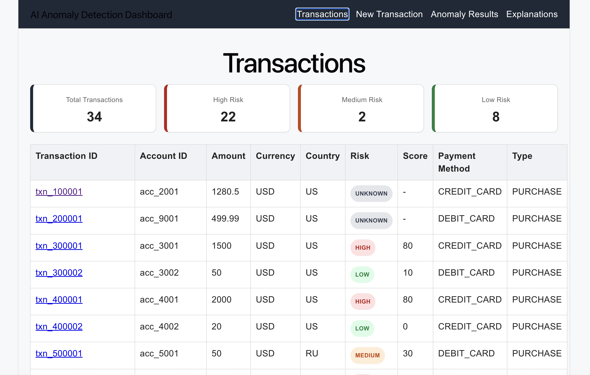
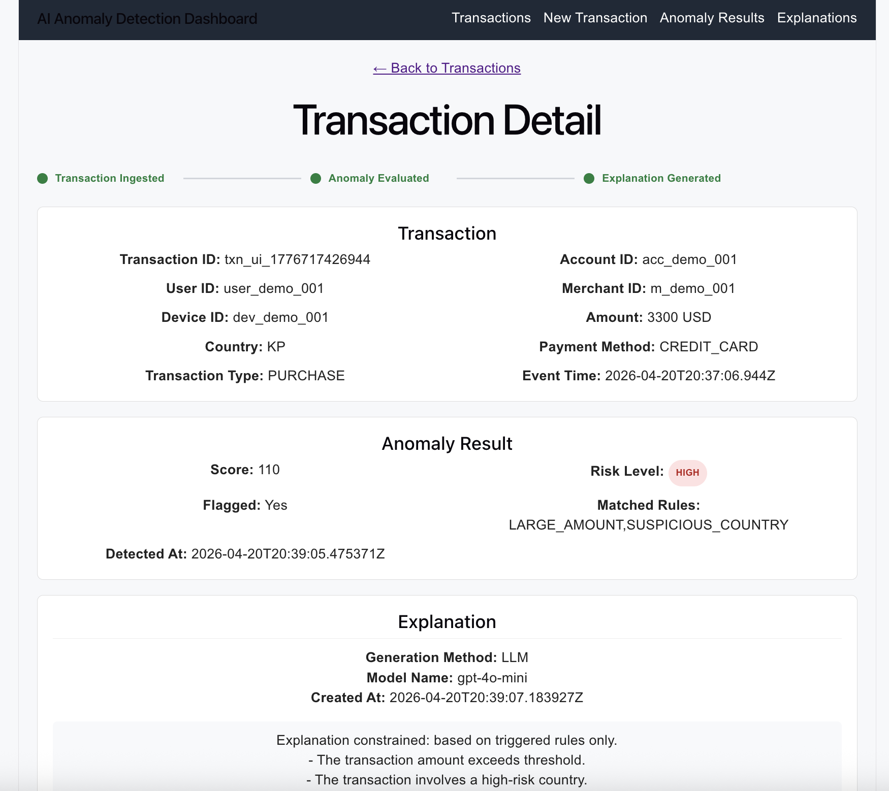
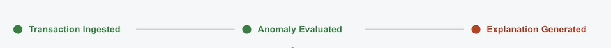
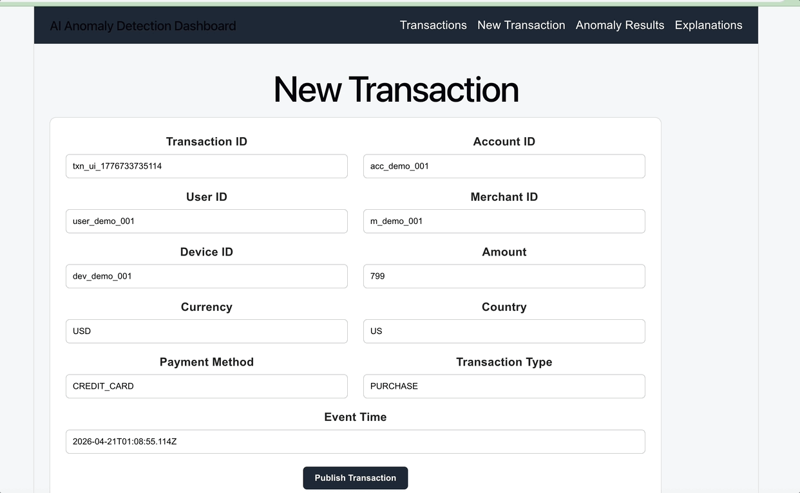

AI Anomaly Detection System with LLM-Based Explanations
=======================================================

🚀 Overview
-----------

This project is an **event-driven anomaly detection system** that analyzes financial transactions and generates **AI-powered explanations** with strict guardrails to ensure correctness and reliability.

It demonstrates how to combine:

-   deterministic rule-based systems

-   event-driven architecture (Kafka)

-   LLM integration (OpenAI)

-   frontend visualization (React)

into a **production-style end-to-end system**.

* * * * *
🎥 Demo
-----------


👉 Flow:

- Create a new transaction
- System processes asynchronously
- Anomaly result + AI explanation appear automatically

📊 Dashboard Overview
-----------




- Transactions table with risk visualization
- Color-coded risk badges (HIGH / MEDIUM / LOW)
- Summary cards showing system-wide metrics

🔍 Transaction Detail (End-to-End View)
-----------




Each transaction includes:

- Raw transaction data
- Anomaly score & matched rules
- AI-generated explanation

⏳ Processing Timeline (Async System Visualization)
-----------




Shows real-time system state:

- Transaction ingested
- Anomaly evaluated
- Explanation generated

👉 Demonstrates eventual consistency and async processing.

➕ New Transaction (Interactive Demo)
-----------




- Submit transactions directly from UI
- Triggers full pipeline:
- API → Kafka → Detection → AI → UI

🧠 Key Features
---------------

-   ✅ Real-time transaction ingestion via Kafka

-   ✅ Rule-based anomaly detection (deterministic engine)

-   ✅ AI-generated explanations with guardrails

-   ✅ Aggregated read API for frontend consumption

-   ✅ Interactive dashboard with live processing states

-   ✅ End-to-end async pipeline with eventual consistency

* * * * *

🏗️ Architecture
----------------

```
                 ┌──────────────┐
                 │   Web UI     │
                 │ (React/Vite) │
                 └──────┬───────┘
                        │
                        ▼
               ┌──────────────────┐
               │   API Service    │
               │ (Spring Boot)    │
               ├──────────────────┤
               │ - REST APIs      │
               │ - Kafka Producer │
               │ - Full View API  │
               └──────┬───────────┘
                      │
                      ▼
          ┌─────────────────────────┐
          │ transaction-events (Kafka)
          └──────────┬─────────────┘
                     ▼
           ┌──────────────────────┐
           │ Detection Service     │
           │ (Rule Engine)         │
           ├──────────────────────┤
           │ - Persist transaction│
           │ - Evaluate rules     │
           │ - Save anomaly       │
           │ - Publish request    │
           └──────────┬───────────┘
                      │
                      ▼
       ┌────────────────────────────┐
       │ explanation-requests (Kafka)
       └──────────┬─────────────────┘
                  ▼
         ┌────────────────────────┐
         │ Explanation Service     │
         │ (LLM + Guardrails)      │
         ├────────────────────────┤
         │ - Call OpenAI           │
         │ - Validate output       │
         │ - Apply fallback logic  │
         │ - Persist explanation   │
         └──────────┬─────────────┘
                    ▼
             ┌──────────────┐
             │ PostgreSQL   │
             └──────────────┘

```

* * * * *

🔄 Data Flow
------------

### Write Path (Async)

1.  User submits a transaction via UI

2.  `api-service` publishes event to Kafka

3.  `detection-service`:

    -   stores transaction

    -   applies anomaly rules

    -   publishes explanation request

4.  `explanation-service`:

    -   calls LLM

    -   applies guardrails

    -   stores explanation

* * * * *

### Read Path (Aggregated)

Frontend calls:

```
GET /transactions/{transactionId}/full-view

```

Returns:

```
{
  "transaction": {...},
  "anomalyResults": [...],
  "explanations": [...]
}

```

* * * * *

🧩 Tech Stack
-------------

### Backend

-   Java 21

-   Spring Boot

-   Spring Kafka

-   PostgreSQL

-   Jackson (JSON processing)

### Frontend

-   React (Vite)

-   React Router

### Infrastructure

-   Apache Kafka (Docker)

-   Docker Compose

### AI

-   OpenAI API (gpt-4o-mini)

* * * * *

🛡️ AI Guardrails
-----------------

LLM output is **not trusted directly**.

The system enforces:

-   ❌ No hallucinated concepts (fraud, money laundering, etc.)

-   ❌ No explanations outside triggered rules

-   ✅ Fallback to rule-based explanation if violated

Example:

```
Explanation constrained: based on triggered rules only.
- The transaction amount exceeds threshold.

```

* * * * *

📊 UI Features
--------------

-   Transactions dashboard with risk visualization

-   Color-coded risk badges (HIGH / MEDIUM / LOW)

-   Summary cards (risk distribution)

-   Transaction detail page:

    -   full data view

    -   anomaly results

    -   explanations

-   Processing timeline:

    -   Transaction → Detection → Explanation

-   Real-time polling for async updates

* * * * *

▶️ Demo Flow
------------

1.  Go to **New Transaction**

2.  Submit a transaction

3.  Observe:

    -   transaction appears

    -   anomaly result appears

    -   explanation appears

4.  Timeline updates automatically

* * * * *

⚙️ How to Run
-------------

### 1\. Start Kafka & PostgreSQL

```
docker-compose up

```

* * * * *

### 2\. Run backend services

```
cd detection-service
./mvnw spring-boot:run

cd explanation-service
./mvnw spring-boot:run

cd api-service
./mvnw spring-boot:run

```

* * * * *

### 3\. Run frontend

```
cd web-ui
npm install
npm run dev

```

* * * * *

### 4\. Open app

```
http://localhost:5173

```

* * * * *

📌 Key Design Decisions
-----------------------

### 1\. Event-Driven Architecture (Kafka)

-   decouples services

-   supports scalability

-   enables async processing

* * * * *

### 2\. Separate Explanation Service

-   isolates LLM latency

-   allows independent scaling

-   supports future AI model replacement

* * * * *

### 3\. Guardrail-Based AI Integration

-   ensures correctness

-   prevents hallucination

-   aligns AI output with business logic

* * * * *

### 4\. Aggregated Read API (Full View)

-   simplifies frontend

-   reduces API calls

-   aligns API design with UI needs

* * * * *

### 5\. Eventual Consistency + Polling

-   reflects real-world distributed systems

-   UI adapts to async processing

-   avoids blocking writes

* * * * *

🔮 Future Improvements
----------------------

-   Retry & circuit breaker (Resilience4j)

-   Explanation caching / deduplication

-   Structured explanation storage (JSON)

-   Filtering & search in dashboard

-   Metrics & monitoring (Prometheus/Grafana)

* * * * *

💡 What This Project Demonstrates
---------------------------------

-   Distributed system design

-   Event-driven architecture

-   Backend/frontend integration

-   AI system design with guardrails

-   Handling eventual consistency

-   Building production-style systems

* * * * *

👤 Author
---------

Siqiu Ma

* * * * *

⭐ Final Note
------------

This project focuses not just on **using AI**, but on:

> **controlling AI behavior within a reliable system**

--- which is critical for real-world applications involving financial risk and decision-making.
